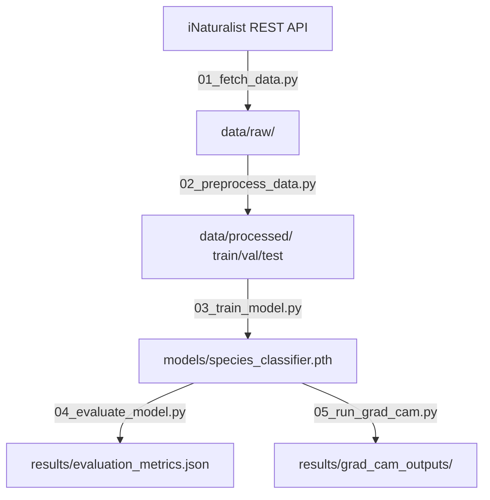

# iNaturalist Species Image Classification Pipeline

[](https://www.python.org/)
[](https://pytorch.org/)
[](https://www.docker.com/)
[](https://docs.pytest.org/)

An end-to-end containerized computer vision pipeline utilizing **MobileNetV3** transfer learning, automated **iNaturalist REST API** data acquisition, stratified dataset pre-processing, comprehensive evaluation metrics, and **Grad-CAM** (Gradient-weighted Class Activation Mapping) explainable AI.

---

## Architecture Diagram

```
+---------------------------------------------------------------------------------------+
|                                    SYSTEM WORKFLOW                                    |
+---------------------------------------------------------------------------------------+
  
   Phase 1: Data Acquisition & Preprocessing
   +-----------------------+      +---------------------+      +---------------------+
   | iNaturalist REST API  | ---> |   data/raw/         | ---> | 02_preprocess_data  |
   | (01_fetch_data.py)    |      | (Species subdirs)   |      | (Stratified Split)  |
   +-----------------------+      +---------------------+      +---------------------+
                                                                          |
                                                                          v
                                                               +---------------------+
                                                               |   data/processed/   |
                                                               | (train / val / test)|
                                                               +---------------------+
                                                                          |
   Phase 2: Model Training & Evaluation                                   |
   +-----------------------+      +---------------------+                 |
   | models/               | <--- | 03_train_model.py   | <---------------+
   | species_classifier.pth|      | (MobileNetV3 Fine)  |
   +-----------------------+      +---------------------+
               |                             |
               v                             v
   +-----------------------+      +---------------------+
   | 04_evaluate_model.py  | ---> | results/            |
   | (Metrics & Confusion) |      | evaluation_metrics  |
   +-----------------------+      +---------------------+
               |
               v
   Phase 3: Explainable AI (XAI)
   +-----------------------+      +---------------------+
   | 05_run_grad_cam.py    | ---> | results/            |
   | (Heatmap Overlays)    |      | grad_cam_outputs/   |
   +-----------------------+      +---------------------+
```

### Mermaid Flowchart



---

## Mandatory Repository Artifacts

This repository fulfills all required submission artifacts:

- **`docker-compose.yml`**: Single-command environment orchestration for running the containerized pipeline.
- **`Dockerfile`**: Production-grade multi-stage build separating builder tools from the lightweight runtime image.
- **`.env.example`**: Fully documented template for all environment configuration variables.
- **`tests/`**: Automated test suite powered by `pytest` covering unit and integration testing.
- **`requirements.txt`**: Pinned application and testing dependencies.
- **`README.md`**: Complete portfolio-grade documentation detailing setup, execution, architecture, and CI/CD readiness.

---

## Multi-Stage Docker Architecture & Security

The `Dockerfile` adheres to containerization best practices:

1. **Stage 1 (Builder)**: Uses `python:3.9-slim`, installs build tools (`build-essential`, `git`), creates a isolated virtual environment (`/opt/venv`), and pre-compiles wheel packages.
2. **Stage 2 (Runtime)**: Copies only the compiled virtual environment `/opt/venv` without build tools, shrinking image size and reducing attack surface.
3. **Security Hardening**: Executes under a unprivileged non-root user (`appuser`, UID `1000`) for enhanced security compliance.

---

## Setup & Execution Instructions

### Option 1: Single-Command Orchestration via Docker Compose (Recommended)

1. **Build and spin up container environment**:
   ```bash
   docker-compose up --build
   ```

2. **Run interactive shell inside container**:
   ```bash
   docker-compose run app bash
   ```

3. **Run automated pytest suite inside container**:
   ```bash
   docker-compose run app pytest
   ```

### Option 2: Local Python Virtual Environment

1. **Create and activate Python 3.9 virtual environment**:
   ```bash
   python -m venv venv
   # On Windows:
   venv\Scripts\activate
   # On Linux/macOS:
   source venv/bin/activate
   ```

2. **Install pinned dependencies**:
   ```bash
   pip install -r requirements.txt
   ```

3. **Configure Environment Variables**:
   Copy `.env.example` to `.env` and adjust configuration if desired:
   ```bash
   cp .env.example .env
   ```

---

## End-to-End Pipeline Execution

Run the processing pipeline sequentially:

### 1. Data Acquisition
Fetch species observations and image assets from the iNaturalist REST API:
```bash
python scripts/01_fetch_data.py
```

### 2. Data Preprocessing & Stratification
Perform a stratified split (70% Train / 15% Val / 15% Test) and build `class_map.json`:
```bash
python scripts/02_preprocess_data.py
```

### 3. Model Training
Fine-tune MobileNetV3-Small on training images with epoch-by-epoch loss tracking:
```bash
python scripts/03_train_model.py
```

### 4. Model Evaluation
Evaluate the checkpoint on test images and export `evaluation_metrics.json` & `confusion_matrix.png`:
```bash
python scripts/04_evaluate_model.py
```

### 5. Grad-CAM Model Explainability (XAI)
Generate spatial attention heatmap overlays for model predictions:
```bash
python scripts/05_run_grad_cam.py
```

---

## Automated Testing Suite (`pytest`)

The `tests/` directory contains unit and integration tests:

Run pytest locally:
```bash
pytest
```

Run pytest with coverage summary:
```bash
pytest --cov=scripts --cov-report=term-missing
```

### Test Coverage Highlights:
- **`tests/test_fetch_data.py`**: API request mock handling and image download resilience.
- **`tests/test_preprocess_data.py`**: Data stratification, directory creation, and class mapping integrity.
- **`tests/test_train_model.py`**: PyTorch MobileNetV3 classifier head dimensions and tensor forward passes.
- **`tests/test_evaluate_model.py`**: Classification metric (Precision, Recall, F1) calculation correctness.
- **`tests/test_integration.py`**: Mandatory artifact checks and script syntax/import validation.

---

## CI/CD Readiness Explanation

This repository is structured for seamless integration into GitHub Actions or GitLab CI pipelines:

1. **Linting & Code Analysis**: Automated runs of `flake8` or `black` to enforce Python best practices.
2. **Container Build & Security Scan**: Automated `docker build` verified alongside vulnerability scanning using `Trivy` or `Docker Scout`.
3. **Automated Test Execution**: CI runner executes `docker-compose run app pytest` to ensure regression prevention.
4. **Artifact Tracking**: Automated publication of generated metrics (`evaluation_metrics.json`) and test reports upon pull request approval.
